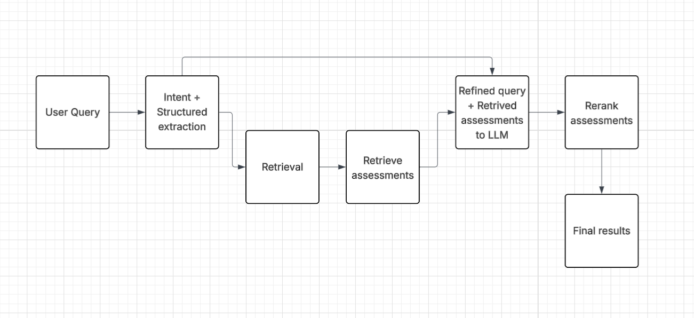

# SHL Assessment Recommendation System

An intelligent recommendation system that takes a natural language query or job description and returns the most relevant SHL Individual Test Solutions using a RAG pipeline powered by LlamaIndex + Groq.

---

## Pipeline Overview



> **Pipeline:** Raw Query / JD → LLM Extraction → Clean Query → Vector Retrieval → Keyword Injection → LLM Re-ranking → Recommended Assessments

---

## Problem Statement

Hiring managers struggle to find the right SHL assessments for roles they are hiring for. The current system relies on keyword filters making it time-consuming and inefficient. This system takes a natural language query or full job description and automatically recommends 5–10 of the most relevant **Individual Test Solutions** from SHL's catalog of 377+ assessments.

**Input:** Natural language query, job description text, or URL to a JD page  
**Output:** 5–10 ranked SHL assessments with name, URL, test type, duration, and description

---

## Workflow

```
┌─────────────────────────────────────────────────────────────────────┐
│                        OFFLINE (Build Once)                         │
│                                                                     │
│  SHL Catalog  ──►  scraper/scrape_shl.py  ──►  shl_assessments.json│
│                            │                                        │
│                            ▼                                        │
│                  indexer/build_index.py                             │
│                            │                                        │
│                            ▼                                        │
│              BAAI/bge-small-en-v1.5 Embeddings                     │
│                            │                                        │
│                            ▼                                        │
│                  indexer/storage/  (VectorStoreIndex)               │
└─────────────────────────────────────────────────────────────────────┘

┌─────────────────────────────────────────────────────────────────────┐
│                        ONLINE (Per Query)                           │
│                                                                     │
│  Raw Query / JD (500+ words)                                        │
│        │                                                            │
│        ▼                                                            │
│  STEP 1: LLM Extraction (Groq)                                      │
│  Extracts: role, technical_skills, soft_skills,                     │
│            experience_level, duration_preference                    │
│        │                                                            │
│        ▼                                                            │
│  STEP 2: Clean Query Builder                                        │
│  "QA Engineer. Skills: Java, Selenium, SQL. Level: senior"          │
│        │                                                            │
│        ▼                                                            │
│  STEP 3: Vector Retrieval (Top-40 candidates)                       │
│        +  Keyword Injection (force-include exact skill matches)     │
│        │                                                            │
│        ▼                                                            │
│  STEP 4: LLM Re-ranking (Groq)                                      │
│  Selects 5–10 balanced assessments (K + P types)                   │
│        │                                                            │
│        ▼                                                            │
│  JSON Response → FastAPI → Streamlit UI                             │
└─────────────────────────────────────────────────────────────────────┘
```

---

## Query Refinement — Key Design Decision

Instead of embedding a raw 500-word job description directly into the vector search, the system first uses an LLM to **extract only the relevant hiring signal**:

**Raw JD input:**
```
Join a community that is shaping the future of work! SHL, People Science. People Answers.
Are you a seasoned QA Engineer... [500 words of company culture, benefits, hashtags]
```

**After LLM extraction:**
```json
{
  "role": "QA Engineer",
  "technical_skills": ["Java", "JavaScript", "Selenium WebDriver", "SQL", "HTML", "CSS"],
  "soft_skills": ["verbal communication", "solution-finding"],
  "experience_level": "senior",
  "duration_preference": 60
}
```

**Clean search query sent to vector index:**
```
QA Engineer. Technical skills: Java, JavaScript, Selenium WebDriver, SQL. 
Soft skills: verbal communication. Experience level: senior.
```

This approach dramatically improves retrieval quality because:
- Noise (company culture, perks, hashtags) is removed before embedding
- Exact skills are extracted and matched precisely
- Duration constraints are captured and respected during re-ranking
- Keyword injection ensures assessments for explicitly mentioned skills are always retrieved even if vector similarity is low

---

## Technology Stack

| Component | Technology | Reason |
|---|---|---|
| **LLM** | Groq — `llama-3.3-70b-versatile` | Free tier, fast inference, strong instruction following |
| **Embeddings** | `BAAI/bge-small-en-v1.5` (HuggingFace) | Local, free, no API key, 384-dim, fast |
| **RAG Framework** | LlamaIndex (`llama-index-core`) | Clean VectorStoreIndex abstraction, persistent storage |
| **Vector Store** | LlamaIndex VectorStoreIndex (local) | Persistent FAISS-backed index stored in `indexer/storage/` |
| **API** | FastAPI | Lightweight, async, automatic OpenAPI docs |
| **Frontend** | Streamlit | Rapid UI, easy deployment |
| **Scraping** | requests + BeautifulSoup | Paginated catalog crawl with detail page extraction |
| **Deployment** | Render (API) + Streamlit Cloud (UI) | Free tier, easy CI/CD |

---

## Project Structure

```
shl-recommender/
├── scraper/
│   ├── scrape_shl.py          # Crawls SHL catalog (377+ assessments)
│   └── shl_assessments.json   # Scraped assessment data
├── indexer/
│   ├── build_index.py         # Builds & persists VectorStoreIndex
│   └── storage/               # Persisted FAISS index files
├── engine/
│   └── recommender.py         # 4-step RAG pipeline
├── api/
│   └── main.py                # FastAPI endpoints (/health, /recommend)
├── frontend/
│   └── app.py                 # Streamlit UI
├── evaluation/
│   ├── evaluate.py            # Mean Recall@10 evaluation script
│   └── eval_results.json      # Train set evaluation results
├── predictions/
│   ├── generate_predictions.py  # Generates test set CSV
│   └── test_predictions.csv     # Final test set predictions
├── assets/
│   └── pipeline.png           # Pipeline diagram
├── requirements.txt
├── render.yaml
└── README.md
```

---

## Evaluation

### Metric: Mean Recall@10

```
Recall@10 = |relevant ∩ top-10 recommended| / |total relevant|
Mean Recall@10 = average across all queries
```

A URL normalization step is applied before comparison since ground truth URLs use `/solutions/products/...` while scraped URLs use `/products/...`:

```python
def normalize_url(url):
    # Both formats → "view/assessment-slug"
    if "view/" in url:
        return "view/" + url.split("view/")[-1].rstrip("/")
    return url.lower().rstrip("/")
```

### Iterative Improvement on Train Set

| Version | Change | Mean Recall@10 |
|---|---|---|
| v1 — Baseline | Raw JD → vector search, no LLM | 0.00* |
| v2 — URL Fix | normalize_url() to handle /solutions/ mismatch | 0.19 |
| v3 — Richer Index | Added job_levels, languages to document text | 0.22 |
| v4 — JD Extraction | LLM extracts role/skills before search | 0.24 |
| v5 — Keyword Inject | Force-include exact skill matches missed by vectors | 0.26 |
| v6 — LLM Reranker | Groq selects balanced K+P mix from top-40 candidates | **0.2656** |

\* v1 scored 0.00 due to URL mismatch — comparisons always failed before normalization fix

### Running Evaluation

```bash
# Evaluate on train set
python evaluation/evaluate.py --data dataset/data.xlsx --api http://localhost:8000

# Generate test predictions
python predictions/generate_predictions.py --data dataset/data.xlsx --api http://localhost:8000
```

### Train Set Per-Query Results

| Query | Recall@10 |
|---|---|
| Java developers + business collaboration | 0.600 |
| COO China cultural fit | 0.500 |
| Radio station JD (KEY RESPONSIBILITIES) | 0.400 |
| Content Writer / SEO | 0.400 |
| Senior Data Analyst | 0.200 |
| Sales new graduates | 0.000 |
| Marketing Manager | 0.000 |
| Content Writer JD (long form) | 0.000 |

**Mean Recall@10 on train set: 0.2656**

---

### Important Limitations on Achievable Score

#### 1. Gold URLs Not Present in Scraped Catalog

Some ground truth assessments were not discovered during scraping and therefore cannot ever be recommended, creating a **hard ceiling on achievable recall** regardless of how good the retrieval is:

| Missing Assessment | Slug |
|---|---|
| Manager 8.0 JFA | `manager-8-0-jfa-4310` |
...

These are either legacy product lines, region-specific variants, or pages that were not reachable from the standard paginated catalog endpoint. A query like "Marketing Manager" scores 0.000 not because the system is performing poorly, but because the expected gold assessment simply does not exist in the 377-record catalog.

#### 2. LLM May Recommend Equally Valid Assessments Not in Gold Labels

The gold labels were annotated by humans and represent **one valid set** of relevant assessments — not the only valid set. The SHL catalog often contains multiple assessments that are equally appropriate for a given role. For example, for a query asking for a Java developer who collaborates with teams:

- Gold label may include: `core-java-entry-level-new`
- LLM recommends: `java-8-new` ← equally valid, tests Java knowledge

The LLM may correctly identify a relevant assessment that a human annotator did not label, which counts as a **miss in Recall@10 even though the recommendation is good**. This means the true quality of the system is likely higher than the Recall@10 score suggests.

These two factors together mean that **0.2656 is not the ceiling of system quality** — it is a lower bound constrained by catalog coverage and annotation completeness.

---

## API

### Health Check
```
GET /health
→ {"status": "healthy"}
```

### Recommend
```
POST /recommend
Content-Type: application/json

{"query": "I am hiring Java developers who collaborate with business teams"}

→ {
    "recommended_assessments": [
      {
        "url": "https://www.shl.com/solutions/products/product-catalog/view/java-8-new/",
        "name": "Java 8 (New)",
        "description": "Multi-choice test measuring Java class design...",
        "duration": 18,
        "test_type": ["Knowledge & Skills"]
      }
    ]
  }
```

---

## Setup & Run

```bash
# 1. Install dependencies
pip install -r requirements.txt

# 2. Set environment variable
echo "GROQ_API_KEY=your_key_here" > .env

# 3. Scrape SHL catalog
python scraper/scrape_shl.py

# 4. Build vector index
python indexer/build_index.py

# 5. Start API (Terminal 1)
uvicorn api.main:app --host 0.0.0.0 --port 8000

# 6. Start Frontend (Terminal 2)
streamlit run frontend/app.py
```
